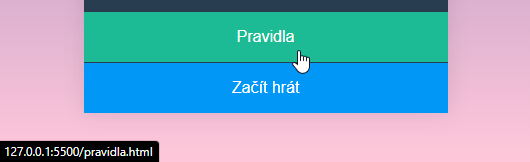
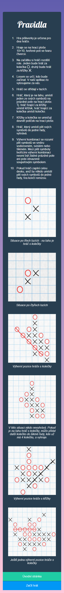
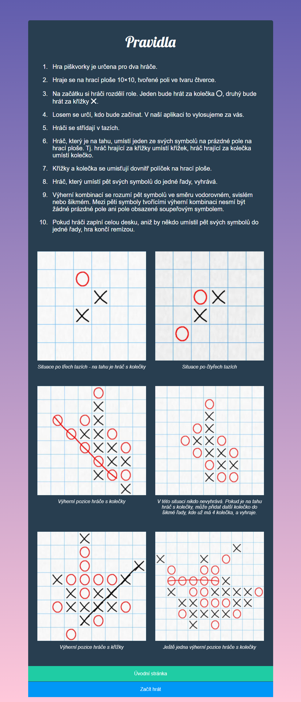
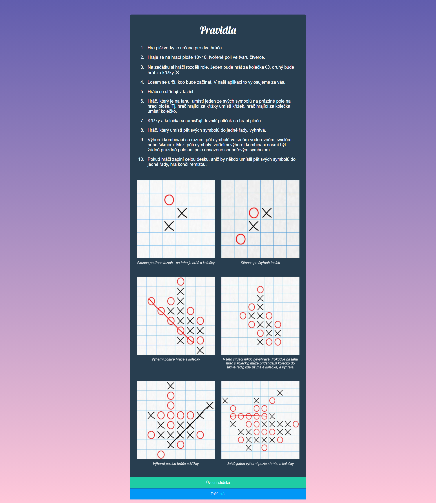

# Úkol: Piškvorky 2/5

Tento úkol navazuje na [Piškvorky 1](https://github.com/Czechitas-podklady-WEB/Ukol-Piskvorky-1). Tentokrát budeš kódovat stránku s pravidly.

## Zadání

1. Pokračuj v repozitáři `piskvorky` z prvního úkolu.

1. Vedle souboru `index.html` přidej nový `pravidla.html`.

1. Přidej do pravidel základní html strukturu a nalinkuj styly (`<link rel="stylesheet" href="styly.css" />`), které budou společné pro úvodní i tuto stránku.

1. Uprav odkaz v `index.html` směřující na pravidla, aby vedl na `pravidla.html` (`href="pravidla.html"`).

   

1. Vše si průběžně kontroluj v prohlížeči. Tlačítko `Pravidla` by zatím mělo otevírat prázdnou stránku s barevným přechodem na pozadí.

1. Nezapomínej průběžně commitovat a nahrávat změny na GitHub.

1. Podle potřeby si stáhni všechny obrázkové podklady.

   - Kroužek: [circle.svg](https://github.com/Czechitas-podklady-WEB/Ukol-Piskvorky-2/raw/main/podklady/circle.svg)
   - Křížek: [cross.svg](https://github.com/Czechitas-podklady-WEB/Ukol-Piskvorky-2/raw/main/podklady/cross.svg)
   - Ukázka ze hry č. 1: [instructions-01.jpg](https://github.com/Czechitas-podklady-WEB/Ukol-Piskvorky-2/raw/main/podklady/instructions-01.jpg)
   - Ukázka ze hry č. 2: [instructions-02.jpg](https://github.com/Czechitas-podklady-WEB/Ukol-Piskvorky-2/raw/main/podklady/instructions-02.jpg)
   - Ukázka ze hry č. 3: [instructions-03.jpg](https://github.com/Czechitas-podklady-WEB/Ukol-Piskvorky-2/raw/main/podklady/instructions-03.jpg)
   - Ukázka ze hry č. 4: [instructions-04.jpg](https://github.com/Czechitas-podklady-WEB/Ukol-Piskvorky-2/raw/main/podklady/instructions-04.jpg)
   - Ukázka ze hry č. 5: [instructions-05.jpg](https://github.com/Czechitas-podklady-WEB/Ukol-Piskvorky-2/raw/main/podklady/instructions-05.jpg)
   - Ukázka ze hry č. 6: [instructions-06.jpg](https://github.com/Czechitas-podklady-WEB/Ukol-Piskvorky-2/raw/main/podklady/instructions-06.jpg)

1. Podle následujících obrázků nastyluj stránku tak, aby se vše vešlo na úzké i široké obrazovky.

   

      
Úzká obrazovka

      
   

   

      
Široká obrazovka

      
   

   

      
Velmi široká obrazovka

      
   

